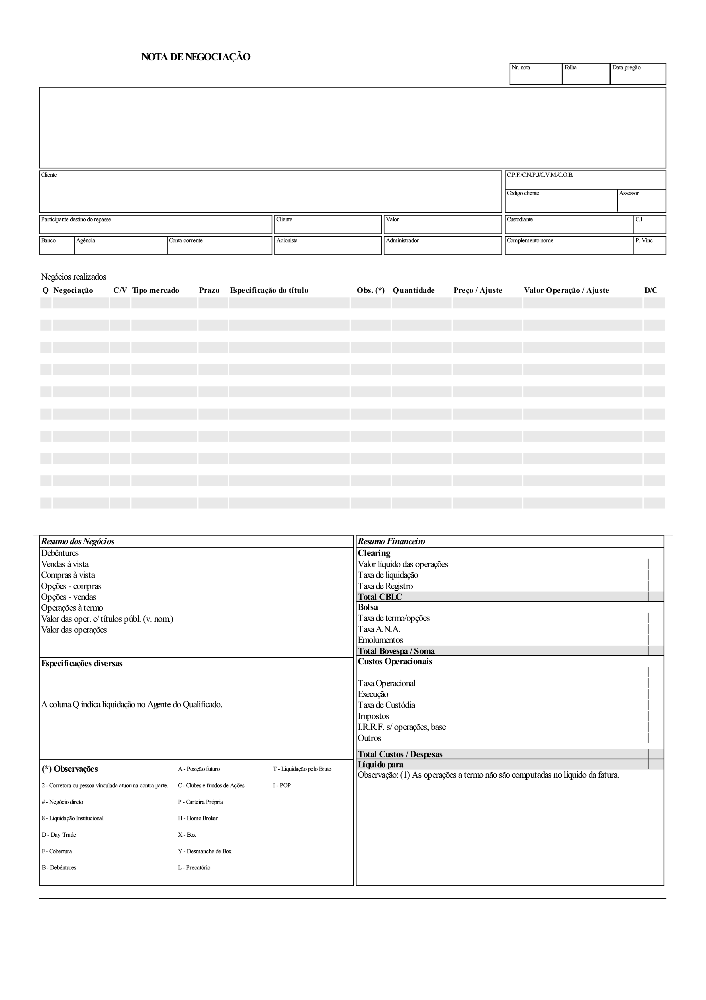
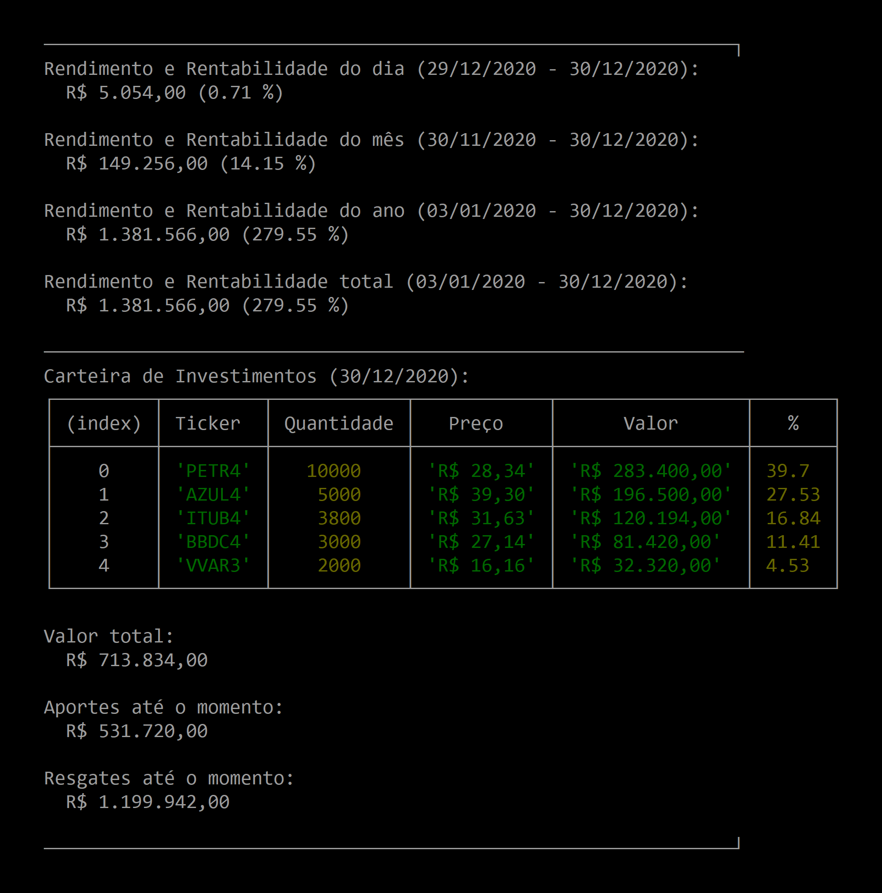

# STONKS
### Descrição

Criação **automatizada** de estruturas de dados
para **controle de investimentos** em **renda variável** com base em informações
extraídas de **Notas de Negociação/Corretagem** disponibilizadas por corretoras
financeiras. O `STONKS` cria arquivos `JSON` e `CSV` que podem ser importados em
programas de *Business Intelligence* (BI) para um melhor acompanhamento visual
da evolução dos investimentos.

**OBS**: Todos os valores financeiros exibidos a seguir são exemplos fictícios.

<!----------------------------------------------------------------------------->
---
### TL;DR

```bash
# Instalação
$ yarn install

# Execução por etapas
$ yarn stocks
$ yarn notes
$ yarn positions
$ yarn prices
$ yarn portfolio
$ yarn status

# Execução completa
$ yarn stonks
```

<!----------------------------------------------------------------------------->
---
### Preparação

O `STONKS` foi criado para consumir as Notas de Negociação da
[XP Investimentos](https://www.xpi.com.br/) e da
[Clear](https://www.clear.com.br/),
mas deve funcionar com outras corretoras também, desde que elas disponibilizem
as Notas no formato `PDF` com o *layout* no padrão Sinacor, como na imagem
abaixo:



Para que o programa leia as Notas de Negociação, é necessário especificar o nome
da pasta onde elas estão presentes. Isso deve ser feito por meio da *string*
`NOTES_FOLDER` da classe `Config` do arquivo [src/Config.js](src/Config.js).
Caso uma ou mais Notas precisem de senha para serem abertas, todas as diferentes
senhas devem ser colocadas no *array* `PASSWORDS`. Geralmente apenas uma senha é
necessária. Neste caso, o *array* terá apenas 1 *string*.
```js
// src/Config.js
module.exports = class Config {
  static NOTES_FOLDER = "/pasta_com_as_notas/";
  static PASSWORDS = ["senha1", "senha2"];
  // ...
}
```

<!----------------------------------------------------------------------------->
---
### Execução

Instalações necessárias:
- `Node.js` ([https://nodejs.org/en/download/](https://nodejs.org/en/download/))
- `Yarn` ([https://classic.yarnpkg.com/en/docs/install](https://classic.yarnpkg.com/en/docs/install))

Para instalar as dependências do programa, abra o terminal na pasta do código
fonte e digite:
```bash
$ yarn install
```

Para executar o programa, siga os seguintes passos:

<!----------------------------------------------------------------------------->
1. Baixe a **lista de ativos** listados na **Bolsa de Valores Brasileira** com o
comando abaixo:
```bash
$ yarn stocks
```
A lista contém ativos de empresas brasileiras e estrangeiras (Brazilian
Depositary Receipts ([BDR](https://www.xpi.com.br/investimentos/acoes/bdr/))).
Este comando só precisa ser executado na primeira vez em que o programa for
utilizado. Caso ocorram novas Ofertas Públicas Iniciais de Ações
([IPO](https://www.xpi.com.br/investimentos/acoes/oferta-publica/)) de empresas
na bolsa, a lista deve ser atualizada. Para isso, basta apagar os arquivos
[companies.json](storage/json/companies.json) e
[stocks.json](storage/json/stocks.json)
e executar o comando novamente.
Após a execução, os arquivos
  [companies.json](storage/json/companies.json),
  [stocks.json](storage/json/stocks.json) e
  [stocks.csv](storage/sheets/stocks.csv)
serão criados:
```js
// companies.json
[
    // ...
    {
      "nome": "ITAUUNIBANCO",
      "razao_social": "ITAU UNIBANCO HOLDING S.A.",
      "segmento": "N1",
      "cvm_code": "19348",
      "cnpj": "60.872.504/0001-23",
      "tickers": [
        "ITUB3",
        "ITUB4"
      ]
    },
    // ...
]
```
```js
// stocks.json
[
    // ...
    {
      "nome": "ITAUUNIBANCO",
      "razao_social": "ITAU UNIBANCO HOLDING S.A.",
      "tipo": "PN",
      "segmento": "N1",
      "cnpj": "60.872.504/0001-23",
      "ticker": "ITUB4"
    },
    // ...
    {
      "nome": "TESLA INC",
      "razao_social": "TESLA. INC",
      "tipo": "",
      "segmento": "DRN",
      "cnpj": "",
      "ticker": "TSLA34"
    },
    // ...
]
```

<!----------------------------------------------------------------------------->
2. Extraia as informações de ***trades*** e **taxas** de cada **Nota de Negociação**
com o comando abaixo:
```bash
$ yarn notes
```
Após a execução, os arquivos
  [trades.json](storage/json/trades.json),
  [trades.csv](storage/sheets/trades.csv),
  [taxes.json](storage/json/taxes.json),
  [taxes.csv](storage/sheets/taxes.csv),
  [tickers.json](storage/json/tickers.json) e
  [tickers.csv](storage/sheets/tickers.csv)
serão criados:
```js
// trades.json
[
    // ...
    {
      "data": "03/04/2020",
      "corretora": "XP INVESTIMENTOS CCTVM S/A",
      "negociacao": "1-BOVESPA",
      "compra_venda": "C",
      "tipo_mercado": "VISTA",
      "prazo": "",
      "especificacao_do_titulo": "ITAUUNIBANCO PN N1",
      "ticker": "ITUB4",
      "quantidade": 10000,
      "preco": 19.83,
      "valor_operacao": 198300
    },
    // ...
    {
      "data": "29/10/2020",
      "corretora": "CLEAR CORRETORA - GRUPO XP",
      "negociacao": "1-BOVESPA",
      "compra_venda": "C",
      "tipo_mercado": "OPCAO DE COMPRA",
      "prazo": "21/12/2020",
      "especificacao_do_titulo": "BBDCL209 PN 20,79 BBDC",
      "ticker": "BBDCL209 12/20",
      "quantidade": 10000,
      "preco": 0.85,
      "valor_operacao": 8500
    },
    // ...
]
```
```js
// taxes.json
[
    // ...
    {
      "data": "29/10/2020",
      "corretora": "CLEAR CORRETORA - GRUPO XP",
      "valor_liquido_das_operacoes": 8500,
      "taxa_de_liquidacao": 0,
      "taxa_de_registro": 0,
      "total_cblc": 8500,
      "taxa_de_termo_opcoes": 0,
      "taxa_ana": 0,
      "emolumentos": 0,
      "total_bovespa_soma": 0,
      "taxa_operacional": 0,
      "execucao": 0,
      "taxa_de_custodia": 0,
      "impostos": 0,
      "irrf_sobre_operacoes": 0,
      "outros": 0,
      "total_custos_despesas": 0,
      "liquido": 8500,
      "taxa_total": 0
    },
    // ...
]
```
```js
// tickers.json
[
    // ...
    "BBDC4",
    "PETRO167 03/20",
    "AZUL4",
    "PETR4",
    "ITUB4",
    "VVAR3",
    "BBDCL209 12/20",
    // ...
]
```

<!----------------------------------------------------------------------------->
3. Calcule todas as **posições de carteira** existentes ao longo do tempo com o
comando abaixo:
```bash
$ yarn positions
```
Cada posição é composta de uma `data` e de todos os *`tickers`* dos ativos que
estavam na carteira no momento, juntamente com a quantidade de cada ativo
(quantidade negativa indica posição *short*). Além disso, cada posição possui
valores chamados `aportes` e `resgates`, que correspondem, respectivamente, às
somas de todos os aportes e de todos os resgates realizados até a data.
Após a execução, os arquivos
  [positions.json](storage/json/positions.json),
  [positions.csv](storage/sheets/positions.csv) e
  [ranges.json](storage/json/ranges.json)
serão criados:
```js
// positions.json
[
    // ...
    {
      "data": "03/04/2020",
      "aportes": 415000,
      "resgates": 598000,
      "BBDC4": -1000,
      "AZUL4": 10000,
      "PETR4": 10000,
      "ITUB4": 10000,
      "VVAR3": 5000,
      // ...
    },
    // ...
]
```
O `ranges` contém as datas de início e de término dos períodos em qua cada ativo
ficou na carteira de investimentos. Caso o ativo não tenha sido removido da
carteira ainda, a data de término será vazia.
```js
// ranges.json
{
    // ...
    "BBDC4": [
      // ...
      {
        "start": "03/01/2020",
        "end": "14/05/2020"
      },
      {
        "start": "03/11/2020",
        "end": ""
      }
    ],
    // ...
}
```

<!----------------------------------------------------------------------------->
4. Baixe o **histórico de preços** de todos os ativos que foram negociados com o
comando abaixo:
```bash
$ yarn prices
```
Após a execução, para cada ativo `ticker` negociado, os arquivos
  [historical/ticker.json](storage/json/historical/) e
  [historical/ticker.csv](storage/sheets/historical/)
serão criados:
```js
// VVAR3.json
{
    "ranges": [
      // ...
      {
        "start": "03/04/2020",
        "end": "21/07/2020"
      },
      {
        "start": "21/12/2020",
        "end": "30/12/2020"
      }
    ],
    "historical": [
      // ...
      {
        "data": "03/04/2020",
        "fechamento": 4.12,
        "variacao": -0.26,
        "variacao_%": -5.94,
        "abertura": 4.36,
        "maxima": 4.37,
        "minima": 3.96,
        "volume": 94686300
      },
      // ...
    ]
}
```

<!----------------------------------------------------------------------------->
5. Calcule a **evolução da carteira de investimentos** ao longo do tempo com o
comando abaixo:
```bash
$ yarn portfolio
```
Cada elemento do *array* `portfolio` é composto de uma `data` e de todos
os *`tickers`* dos ativos que estavam na carteira no momento, juntamente com o
valor (quantidade * preço) em reais de cada ativo (valor negativo indica
posição *short*). Há também o valor `total`, com a soma dos valores de todos os
ativos. Além disso, cada elemento possui valores chamados `aportes` e
`resgates`, que correspondem, respectivamente, às somas de todos os aportes e
de todos os resgates realizados até a data.
Após a execução, os arquivos
  [portfolio.json](storage/json/portfolio.json) e
  [portfolio.csv](storage/sheets/portfolio.csv)
serão criados:
```js
// portfolio.json
[
    // ...
    {
      "data": "03/04/2020",
      "aportes": 416700,
      "resgates": 598000,
      "total": 504360,
      "BBDC4": -19240,
      "AZUL4": 142900,
      "PETR4": 152800,
      "ITUB4": 207300,
      "VVAR3": 20600,
      // ...
    },
    // ...
]
```

<!----------------------------------------------------------------------------->
6. Veja o ***status*** (diário, mensal, anual e total) dos **rendimentos** e
das **rentabilidades nominais** da carteira de investimentos com o
comando abaixo:
```bash
$ yarn status
```
Após a execução, o *status* será exibido no terminal da seguinte maneira:


<!----------------------------------------------------------------------------->
0. Para executar **todos os passos** anteriores com um **único comando**, basta
digitar:
```bash
$ yarn stonks
```

<!----------------------------------------------------------------------------->
---
### Códigos

Linguagem utilizada: **Javascript (ES6)**
- [src/main.js](src/main.js)
    - Arquivo com a função principal.
- [src/Stonks.js](src/Stonks.js)
    - Classe com todas as funções que manipulam as estruturas de dados criadas.
- [src/Notes.js](src/Notes.js)
    - Classe de extração de dados das Notas de Negociação/Corretagem.
- [src/Scraper.js](src/Scraper.js)
    - Classe com os scripts que fazem *download* de dados da internet.
- [src/Storage.js](src/Storage.js)
    - Classe que gerencia a leitura e escrita de arquivos JSON e CSV,
    usados como *inputs* e *outputs* do programa.
- [src/Utils.js](src/main.js)
    - Classe com funções úteis para o desenvolvimento.
- [src/Config.js](src/main.js)
    - Classe com as configurações do programa.

<!----------------------------------------------------------------------------->
---
### To do:

- Cálculo de preço médio dos ativos.
- Cálculo de impostos para o DARF.
- Exercício de Opções.
- Cálculo de Dividendos.
- Aluguel de Ações.
- Rentabilidade separada por ativo.
- ...

<!----------------------------------------------------------------------------->
